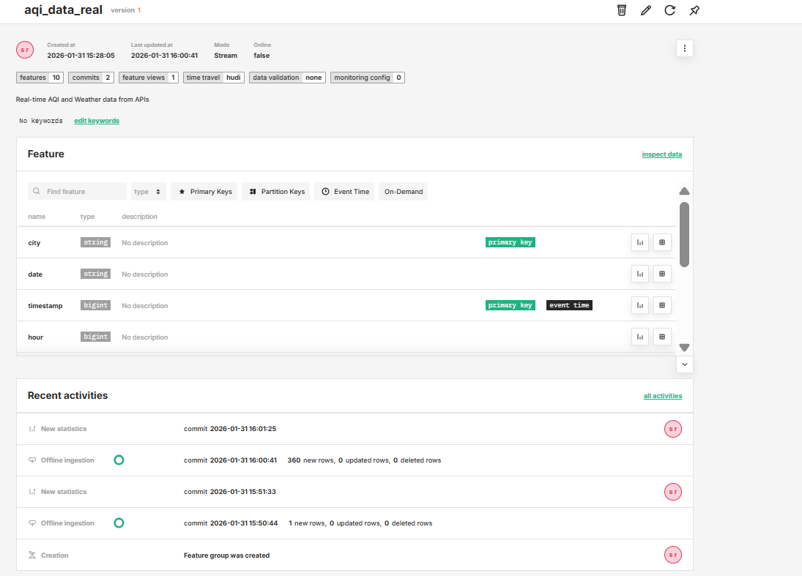
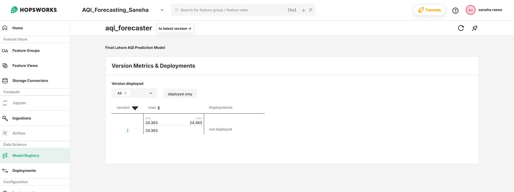
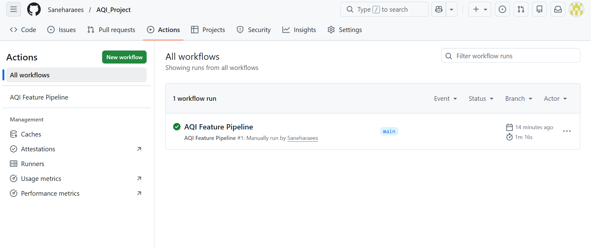
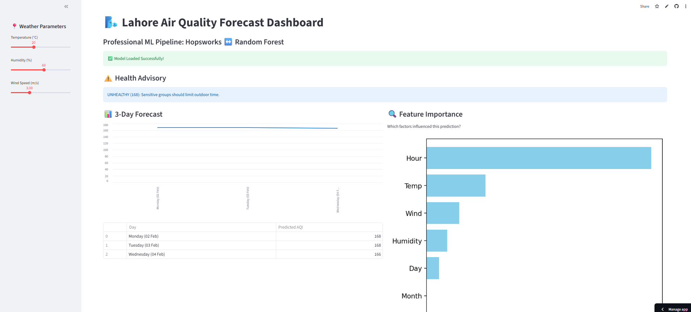

#  Pearls AQI Predictor: Lahore Air Quality Forecast
An end-to-end, 100% serverless machine learning pipeline that predicts the Air Quality Index (AQI) for the next 3 days using a real-time data stack.

---

##  Project Overview
This project forecasts Lahore's AQI by combining live weather data with historical trends. It utilizes a modern MLOps architecture where data collection, model training, and predictions are fully automated without needing a dedicated server.

##  Technical Architecture

### 1. Feature Pipeline (Automated)
- **Data Source:** Fetching real-time weather (Temperature, Humidity, Wind Speed) and AQI data via OpenWeather & AQICN APIs.
- **Automation:** Powered by **GitHub Actions**, the pipeline runs hourly to fetch and update the latest data.
- **Feature Store:** Processed features are stored in **Hopsworks Feature Store** for organized retrieval.

### 2. Training Pipeline
- **Model:** Random Forest Regressor (Scikit-learn).
- **Backfill:** Historical data (15+ days) used to create a robust training set.
- **Model Registry:** Trained models are versioned and stored in the **Hopsworks Model Registry** for seamless deployment.

### 3. Inference & Dashboard (Streamlit)
- **Real-time Prediction:** Downloads the latest model from Hopsworks and computes 3-day forecasts on the fly.
- **Explainable AI (XAI):** Built-in feature importance visualization to show which weather factors (e.g., Wind or Temp) are driving the AQI.
- **Health Alerts:** Integrated hazard notification system based on predicted AQI levels.

---

##  Technology Stack
* **Language:** Python
* **ML Framework:** Scikit-learn (Random Forest)
* **Feature Store:** Hopsworks
* **Automation:** GitHub Actions (CI/CD)
* **Frontend:** Streamlit Cloud
* **API Integration:** OpenWeather API

---

##  Key Results
- **Mean Absolute Error (MAE):** ~24.36 (High precision for atmospheric forecasting).
- **Automation Frequency:** Hourly data updates via Serverless CRON jobs.
- **Accessibility:** Fully responsive web dashboard with health advisories.

##  Project Showcase

| 1. Feature Store (Data) | 2. Model Registry (ML Model) |
| :---: | :---: |
|  |  |
| *Automated Feature Ingestion* | *Versioned ML Models* |

| 3. Automation (GitHub Actions) | 4. Live Dashboard (Streamlit) |
| :---: | :---: |
|  |  |
| *Hourly Pipeline Updates* | *Real-time AQI Forecasts* |

---

##  How to Run Locally
1. Clone the repo: `git clone <your-repo-link>`
2. Install requirements: `pip install -r requirements.txt`
3. Add your API keys to a `.env` file.
4. Run the dashboard: `streamlit run app.py`

---
##  Live Demo
Aap is project ka live dashboard yahan dekh sakte hain:
**[ Click Here to View Live AQI Forecast Dashboard](https://aqiproject-ey64xgexux8lldtewovdxw.streamlit.app/)**
**Developed by Saneha | [www.linkedin.com/in/saneha-raees-68a699275]**
